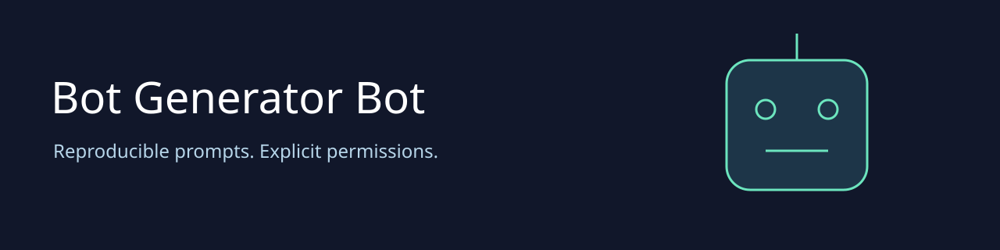

# Bot Generator Bot v2

Turn a bot idea into a reproducible prompt manifest that an agent host can inspect and validate. Choose a starter template, describe the purpose, and define the expected output fields. The compiler produces messages, explicit tool requests and a content digest. It never runs generated commands or calls a model.

The original 2023 project was a prompt collection. This preview adds working software while preserving that collection under `prompts/` for historical reference. Those older prompts are not reviewed execution policies or qualified medical/legal systems.

| Capability | What it does |
| --- | --- |
| Three starter templates | Support responses, research organization, code review |
| Deterministic compiler | Same normalized specification produces identical manifest and SHA256 |
| Typed output validation | Rejects missing/extra fields, invalid types and unsafe numbers |
| Operator tool policy | Requests must be in a fixed catalog and the operator allowlist; requests never grant authority |
| CLI and MCP | Eight tools, three prompt templates, one policy resource |
| MetaHarness | Actual kernel, host adapters, agent profiles, session replay and authenticated field memory adapter |
| Autogenous | Pinned upstream fitness gates with no automatic promotion |
| CI delivery | Tests, dependency audit, provenance checks and downloadable artifacts |

## Quick start

Requires Node 24. Clone this repository and run:

```sh
npm ci --ignore-scripts
node src/cli.mjs templates
node src/cli.mjs compile < fixtures/support-request.json > bot-manifest.json
node src/cli.mjs validate < fixtures/output-request.json
npm test
npm run benchmark
```

The compiler input is `{ "spec": { "name", "purpose", "context", "examples", "output", "tools" } }`; use the complete JSON example in [fixtures/support-request.json](fixtures/support-request.json). Output fields support `string`, `number`, `integer` and `boolean`. All fields are required and extra fields reject. The input cap is 32 KiB, strings 8 KiB, nesting 12 levels, and output schemas 16 fields.

Set `BOT_ALLOWED_TOOLS=search` locally to permit a specification to request the catalog's search tool. A host still needs separate authorization before executing any tool. No tokens or provider credentials belong in specifications. `verify` checks manifest consistency, not authorship: an attacker can create a different consistent manifest.

## Use from an MCP host

```sh
node src/cli.mjs mcp
```

Configure your host with command `node` and the absolute path to `src/cli.mjs`, followed by `mcp`. MCP tools are `status`, `templates`, `template`, `compile`, `validate`, `verify`, `test`, and `benchmark`. Resources include `ruv://bot-generator-bot/policy`; prompt discovery exposes the three starters.

Tests over MCP require an operator to set `BOT_ALLOW_VALIDATION=1`. Test subprocesses use one slot, a stripped environment, a 30 second deadline and a 64 KiB output bound. CLI `test` is an explicit local opt-in. MCP callers cannot choose executable commands, files, destinations or endpoints. Compilation has no provider cost; model quality and deployment reliability are not implied by compiler success.

## Harness and development

See the [generated agent guide](.harness/generated/README.md) and [governance gate](.harness/autogenous/README.md). Install domain dependencies above before invoking domain commands through the generated CLI. Run generated tests, build and doctor using the guide. Sessions support replay/fork; field memory requires deployment-owned storage, verifier and identity key. No live memory service or autonomous deployment is provisioned.

[Architecture decision](docs/adr/0001-typed-prompt-manifests.md), [security review](docs/SECURITY.md), [validation evidence](docs/VALIDATION.md), [selection provenance](docs/selection.json), and [historical README](docs/historical-2023.md) explain the supported boundary and limitations.

## RuV ecosystem

[RuFlo](https://github.com/ruvnet/ruflo) orchestrates agents. [MetaHarness](https://github.com/ruvnet/metaharness) supplies this repository's tested agent harness. [Autogenous](https://github.com/ruvnet/autogenous) supplies the fitness gate. [PromptLang](https://github.com/ruvnet/promptlang) is a related typed compiler, [Dynamo MCP](https://github.com/ruvnet/dynamo-mcp) generates project scaffolds, and [Federated MCP](https://github.com/ruvnet/federated-mcp) observes [x.ruv.io](https://x.ruv.io). Related links are not claims of deployed integration.
